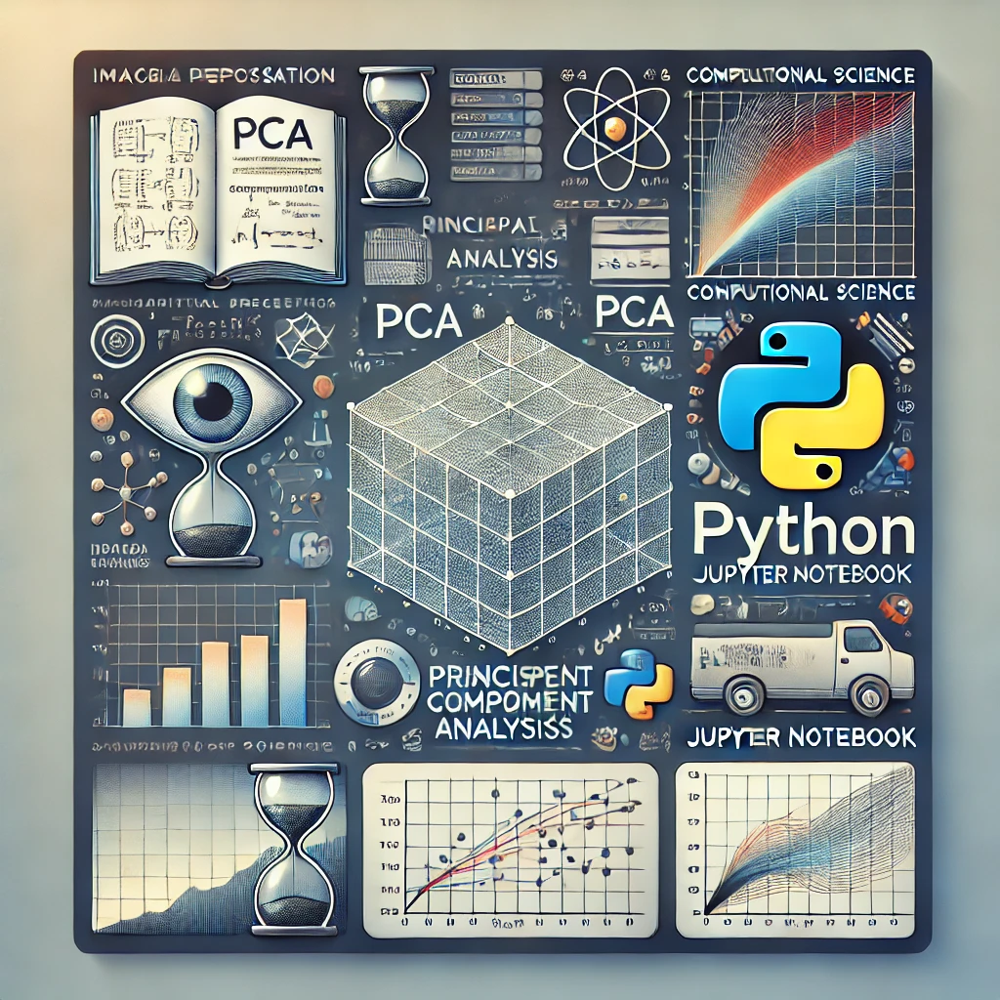

# 🖼️ EigenFaces: Análise e Manipulação de Imagens com PCA

Um projeto que utiliza Análise de Componentes Principais (PCA) para processamento de imagens, redução de dimensionalidade e reconhecimento facial, desenvolvido em Python e Jupyter Notebook.

## 📚 Tabela de Conteúdos

- [🖼️ EigenFaces: Análise e Manipulação de Imagens com PCA](#️-eigenfaces-análise-e-manipulação-de-imagens-com-pca)
  - [📚 Tabela de Conteúdos](#-tabela-de-conteúdos)
  - [📋 Descrição](#-descrição)
    - [🚀 Funcionalidades](#-funcionalidades)
    - [📸 Prévia](#-prévia)
  - [⚙️ Construção](#️-construção)
    - [💻 Tecnologias](#-tecnologias)
    - [🛠️ Ferramentas](#️-ferramentas)
    - [📌 Versão](#-versão)
  - [📥 Instalação e Execução](#-instalação-e-execução)
    - [Pré-requisitos](#pré-requisitos)
    - [Passos](#passos)
  - [✏️ Aprendizados](#️-aprendizados)
  - [✒️ Autor](#️-autor)
  - [🎁 Agradecimentos](#-agradecimentos)
  - [📨 Contato](#-contato)

## 📋 Descrição

Este projeto explora o uso de PCA para analisar e processar imagens faciais. Ele inclui funcionalidades para redução de dimensionalidade, reconstrução de imagens, reconhecimento facial e visualização das autofaces. É um projeto de ciência computacional e análise de dados, demonstrando a eficácia do PCA em dados de alta dimensionalidade.

### 🚀 Funcionalidades

- Calcular e exibir autofaces para um conjunto de imagens.
- Reconstruir imagens utilizando PCA.
- Classificar e reconhecer rostos em um conjunto de dados.
- Visualizar a redução de dimensionalidade com gráficos 3D.
- Suporte para pré-processamento de imagens personalizadas (redimensionamento, conversão para escala de cinza).

### 📸 Prévia

  

## ⚙️ Construção

### 💻 Tecnologias

Tecnologias utilizadas no projeto:

### 🛠️ Ferramentas

Ferramentas utilizadas durante o desenvolvimento:

### 📌 Versão

Este é o projeto na versão 1.0.

## 📥 Instalação e Execução

Siga os passos abaixo para configurar o projeto localmente.

### Pré-requisitos

- Python 3.8 ou superior instalado.
- `git` instalado.

### Passos

1. Clone o repositório:
   git clone https://github.com/milton-salgado/eigenfaces.git
   cd eigenfaces
   

2. Crie um ambiente virtual:
   - **Linux/macOS**:
     python3 -m venv .venv
     source .venv/bin/activate
     
   - **Windows**:
     python -m venv .venv
     .venv\Scripts\activate
     

3. Instale as dependências:
   pip install -r docs/requirements.txt
   

4. Execute o projeto:
   Abra o arquivo `eigenfaces.ipynb` no Jupyter Notebook e execute as células.

## ✏️ Aprendizados

Com este projeto, aprendi:

- Implementar PCA para análise de imagens.
- Utilizar bibliotecas Python como OpenCV, NumPy e Matplotlib para computação científica e visualização.
- Aspectos teóricos e práticos de redução de dimensionalidade e suas aplicações em reconhecimento facial.

## ✒️ Autor

* **Milton Salgado Leandro** - *Todo o Projeto* - [GitHub](https://github.com/milton-salgado)

## 🎁 Agradecimentos

- Agradeço ao professor da disciplina de Computação Científica e Análise de Dados, João Antônio Récio Paixão por me guiar durante o desenvolvimento deste projeto e no aprendizado na disciplina, principalmente em relação ao uso de PCA e pela recomendação do tema de Eigenfaces
- Obrigado à comunidade de código aberto pelas poderosas ferramentas disponibilizadas.

## 📨 Contato

